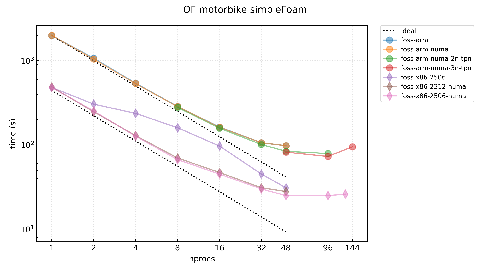

# Running OpenFOAM in Deucalion

## Some useful commands

In this section, we present a series of useful commands to use with Deucalion. The OpenFOAM (OF) tutorial begins in the next section. Before continuing with with this tutorial, it is advisable to read the job submission section of Deucalion’s documentation [https://docs.deucalion.macc.fccn.pt/jobs/](https://docs.deucalion.macc.fccn.pt/jobs/).

If you do not have previous experience working with an HPC cluster, it is advisable to check out the [Introduction to High-Performance Computing](https://carpentries-incubator.github.io/hpc-intro/) carpentry, especially sections [4](https://carpentries-incubator.github.io/hpc-intro/13-scheduler.html) and [6](https://carpentries-incubator.github.io/hpc-intro/15-modules.html).

### Changing to `projects` folder

Deucalion has two separate storage systems: a first system to store each user’s personal data, referred to as the `home` folder of the user, given its location in the file system; and a second system referred to as the `projects` folder, where the data resulting from the work of the project should be stored. We should always use the `projects` folder to run our simulations, since the use of the `home` folder is significantly constrained, both in the number of files that can be created, and in the total available storage per user.

Hence, to change directory to our projects folder we can use the `cdp`  command in a login shell:

```
[franciscovide@ln04 ~]$ cdp
 Select a project: (Use arrow keys)
   I20250009
 » F202500001HPCVLABEPICURE
```

### Start an interactive job in an x86 node

To submit any job in Deucalion, be it an interactive job or a batch job, we need to know the account reference of our active project. To do so, we can run the `billing` command:

```
[franciscovide@ln04 ~]$ billing
┏━━━━━━━━━━━━━━━━━━━━━━━━━━━┳━━━━━━━━━━┳━━━━━━━━━━━┳━━━━━━━━━━┓
┃ Account                   ┃ Used (h) ┃ Limit (h) ┃ Used (%) ┃
┡━━━━━━━━━━━━━━━━━━━━━━━━━━━╇━━━━━━━━━━╇━━━━━━━━━━━╇━━━━━━━━━━┩
│ f202500001hpcvlabepicurea │  1200929 │   3000000 │    40.03 │
│ f202500001hpcvlabepicureg │     4052 │      5000 │    81.04 │
│ f202500001hpcvlabepicurex │   542162 │    620000 │    87.45 │
└───────────────────────────┴──────────┴───────────┴──────────┘
```

here we see the account references followed by the number of `CPU.h` used. It's important to note that the last letter of this account code refers to the type of resource that is allocated to that reference:

* Finishing with an `a`: account reference to be used in ARM jobs;
* Finishing with an `x`: account reference to be used in x86 jobs;
* Finishing with a `g`: account reference to be used in GPU jobs;

Thus, if we wish to submit a batch job or start an interactive job in an x86 node, we need to use the account reference ending with an `x`.

To start an interactive job in a x86 node, we can run:

```bash
srun -A <PROJECT_ACCOUNT> --partition=dev-x86 --time=04:00:00 --nodes=1 --ntasks=128 --pty bash
```

where the `<PROJECT_ACCOUNT>` should be replaced with the adequate reference.

We may want to create an alias for this command, if we plan to use it frequently. To do so, we can run:

```bash
echo "alias sx86='srun -A <PROJECT_ACCOUNT> --partition=dev-x86 --time=04:00:00 --nodes=1 --ntasks=128 --pty bash'" >> ~/.bashrc && source ~/.bashrc
```

with this, we can run the same command with the alias `sx86`.

### Start an interactive job in an ARM node

After determining the account reference for the allocated ARM resources, as explained above, we can start an interactive job in an ARM node by running:

```bash
srun -A <PROJECT_ACCOUNT> --partition=dev-arm --time=04:00:00 --nodes=1 --ntasks=48 --pty bash
```

where the `<PROJECT_ACCOUNT>` should be replaced with the adequate reference (ending in `a`).

Again, if we wish to create an alias for this command, we can run:

```bash
echo "alias sarm='srun -A <PROJECT_ACCOUNT> --partition=dev-arm --time=04:00:00 --nodes=1 --ntasks=48 --pty bash'" >> ~/.bashrc && source ~/.bashrc
```

and run `sarm` when we wish to start and ARM interactive session.

## Which versions of OF are available in each Deucalion partition?

To see which versions of OpenFOAM are available in Deucalion, we can run the following command in a node of each architecture:

```bash
ml av openfoam # the same as `module avail openfoam`
```

For the `x86` architecture, we may run this command in a login node, since the login nodes are `x86`. Doing so will return the following output:

```
[franciscovide@ln04 ~]$ ml av openfoam

------------ EasyBuild -------------
   OpenFOAM-Extend/4.1-20200408-foss-2019b-Python-2.7.16
   OpenFOAM-Extend/5.0-20Sep2022-foss-2022a-Python-3.10.4
   OpenFOAM-Extend/5.0-20Sep2022-foss-2023a-287705        (D)
   OpenFOAM/v2206-foss-2023a
   OpenFOAM/v2312-foss-2022a
   OpenFOAM/v2312-foss-2023a
   OpenFOAM/v2406-foss-2023a
   OpenFOAM/v2412-foss-2023a
   OpenFOAM/v2506-foss-2025a
   OpenFOAM/v2512-foss-2025a
   OpenFOAM/9-foss-2023a
   OpenFOAM/10-foss-2023a-O2-vec
   OpenFOAM/13-foss-2025a                                 (D)

  Where:
   D:  Default Module

If the avail list is too long consider trying:

"module --default avail" or "ml -d av" to just list the
default modules.
"module overview" or "ml ov" to display the number of
modules for each name.

Use "module spider" to find all possible modules and
extensions.
Use "module keyword key1 key2 ..." to search for all
possible modules matching any of the "keys".
```

If we wish to see the available OF version in ARM, we must first start an interactive job in an ARM node:

```bash
srun -A <PROJECT_ACCOUNT> --partition=dev-arm --time=04:00:00 --nodes=1 --ntasks=48 --pty bash
```

When in an ARM node, we can then check the available OF versions for this architecture:

```
[franciscovide@cna0001 ~]$ ml av openfoam

---------- EasyBuild -----------
   OpenFOAM-Extend/5.0-20Sep2022-foss-2023a-287705
   OpenFOAM/v2206-foss-2022a
   OpenFOAM/v2312-gompi-2022a
   OpenFOAM/v2406-foss-2023a
   OpenFOAM/v2412-foss-2023a
   OpenFOAM/v2506-foss-2025a
   OpenFOAM/v2512-foss-2025a
   OpenFOAM/9-foss-2023a
   OpenFOAM/12-foss-2023a
   OpenFOAM/13-foss-2025a-no-pv                   (D)

  Where:
   D:  Default Module

If the avail list is too long consider trying:

"module --default avail" or "ml -d av" to just list
the default modules.
"module overview" or "ml ov" to display the number
of modules for each name.

Use "module spider" to find all possible modules and
extensions.
Use "module keyword key1 key2 ..." to search for all
possible modules matching any of the "keys".
```

> Notice that we are in the ARM node `cna0001` (in the prompt we first have the username, `franciscovide`, followed by the node in which the current shell is running, `cna0001`, ending with the current directory name, `~`). The node naming convention in Deucalion is the following:
>
> * `cnaXXXX`: ARM nodes
> * `cnxXXXX`: x86 nodes
> * `gnxXXXX`: x86 accelerated nodes (with GPUs)

## Running the `motorBike` case

As a simple example, we will see how to run the `motorBike` case of `simpleFoam` in Deucalion. We will use the `OpenFOAM/v2512-foss-2025a` version in an ARM node.

First, and from our login shell, we change directory to our `projects` folder, using the `cdp`  command:

```
[franciscovide@ln04 ~]$ cdp
 Select a project: (Use arrow keys)
   I20250009
 » F202500001HPCVLABEPICURE
```

then, we create a folder with our username, and move our shell into it:

```bash
[franciscovide@ln04 F202500001HPCVLABEPICURE]$ mkdir $USER && cd $USER
```

We can now set up our case directory. We start an interactive job in an ARM node from our current shell, such that we make sure that we are copying the tutorial case of the correct OF version:

```bash
[franciscovide@ln04 franciscovide]$ srun -A <PROJECT_ACCOUNT> --partition=dev-arm --time=04:00:00 --nodes=1 --ntasks=48 --pty bash
srun: job 1383364 queued and waiting for resources
srun: job 1383364 has been allocated resources
[franciscovide@cna0001 franciscovide]$
```

After this, we load the `OpenFOAM/v2512-foss-2025a` module, as well as the OpenFOAM environment variables by sourcing the `$FOAM_BASH` script:

```bash
[franciscovide@cna0001 franciscovide]$ ml OpenFOAM/v2512-foss-2025a
[franciscovide@cna0001 franciscovide]$ source $FOAM_BASH
[franciscovide@cna0001 franciscovide]$
```

We can now find the `motorBike` case and copy it to our `projects` folder by making use of tab completion: we begin our command with `cp -r $FOAM_TUTORIALS/` and hit tab twice to see which folders are present in each directory level, finishing the command by adding ` .` when we find the `motorBike` case directory:

```bash
[franciscovide@cna0001 franciscovide]$ cp -r $FOAM_TUTORIALS/
Allclean                   DNS/                       mesh/
Allcollect                 electromagnetics/          modules/
Allrun                     financial/                 multiphase/
Alltest                    finiteArea/                preProcessing/
basic/                     heatTransfer/              resources/
combustion/                incompressible/            stressAnalysis/
compressible/              IO/                        verificationAndValidation/
discreteMethods/           lagrangian/
[franciscovide@cna0001 franciscovide]$ cp -r $FOAM_TUTORIALS/incompressible/
adjointOptimisationFoam/      pimpleFoam/
adjointShapeOptimizationFoam/ pisoFoam/
boundaryFoam/                 porousSimpleFoam/
icoFoam/                      shallowWaterFoam/
lumpedPointMotion/            simpleFoam/
nonNewtonianIcoFoam/          SRFPimpleFoam/
overPimpleDyMFoam/            SRFSimpleFoam/
overSimpleFoam/
[franciscovide@cna0001 franciscovide]$ cp -r $FOAM_TUTORIALS/incompressible/simpleFoam/
airFoil2D/            pitzDaily/            squareBend/
backwardFacingStep2D/ pitzDailyExptInlet/   T3A/
bump2D/               pitzDaily_fused/      turbineSiting/
mixerVessel2D/        rotatingCylinders/    turbulentFlatPlate/
motorBike/            rotorDisk/            windAroundBuildings/
pipeCyclic/           simpleCar/
[franciscovide@cna0001 franciscovide]$ cp -r $FOAM_TUTORIALS/incompressible/simpleFoam/motorBike .
[franciscovide@cna0001 franciscovide]$
```

We can now move into the `motorBike` directory and inspect it:

```bash
[franciscovide@cna0001 franciscovide]$ ls motorBike
0.orig  Allclean  Allrun  constant  system
[franciscovide@cna0001 franciscovide]$
```

After this, we can close our interactive job with the `exit` command (or by pressing `Ctrl-d`):

```bash
[franciscovide@cna0001 franciscovide]$ exit
exit
[franciscovide@ln04 franciscovide]$
```

Next, we check the number of MPI Ranks used in this example by inspecting the `Allrun` script:

```bash
[franciscovide@ln04 franciscovide]$ cd motorBike
[franciscovide@ln04 motorBike]$ cat Allrun
#!/bin/sh
cd "${0%/*}" || exit                                # Run from this directory
. ${WM_PROJECT_DIR:?}/bin/tools/RunFunctions        # Tutorial run functions
#------------------------------------------------------------------------------

# Alternative decomposeParDict name:
decompDict="-decomposeParDict system/decomposeParDict.6"
## Standard decomposeParDict name:
# unset decompDict
...
```

and we see that the domain decomposition is defined in the `system/decomposeParDict.6` file:

```bash
[franciscovide@ln04 motorBike]$ cat system/decomposeParDict.6
/*--------------------------------*- C++ -*----------------------------------*\
| =========                 |                                                 |
| \\      /  F ield         | OpenFOAM: The Open Source CFD Toolbox           |
|  \\    /   O peration     | Version:  v2512                                 |
|   \\  /    A nd           | Website:  www.openfoam.com                      |
|    \\/     M anipulation  |                                                 |
\*---------------------------------------------------------------------------*/
FoamFile
{
    version     2.0;
    format      ascii;
    class       dictionary;
    object      decomposeParDict;
}
// * * * * * * * * * * * * * * * * * * * * * * * * * * * * * * * * * * * * * //

numberOfSubdomains 6;

method          hierarchical;

coeffs
{
    n           (3 2 1);
}

\
// ************************************************************************* //
```

which defines the partitioning of the mesh into 6 subdomains, hence 6 MPI Ranks are to be used. As such, we will set up the batch script to use 6 tasks. We can create this script with the following command (you can simply copy and paste on your terminal from `cat` until the last `EOF`):

```bash
[franciscovide@ln04 motorBike]$ cat <<EOF > run.sh
#!/bin/bash
#SBATCH --job-name=of
#SBATCH --output=of.o%j
#SBATCH --error=of.e%j
#SBATCH --partition=normal-arm
#SBATCH --time=48:00:00
#SBATCH --ntasks=6
#SBATCH --account=<PROJECT_NUMBER>

ml OpenFOAM/v2512-foss-2025a
source \$FOAM_BASH

./Allrun
EOF
```

Edit this file such that the correct project number is used (take care to choose the project number ending with an `a`, since we are submitting a simulation to an ARM node), either with `nano` or the `vim` editor:

```bash
[franciscovide@ln04 motorBike]$ nano run.sh
```

After changing to the correct project number, we can save the changes and exit by pressing `Ctrl-x` and following the instructions at the bottom of the terminal window.

Notice that we set the flag `--ntasks=6`  such that 6 MPI Ranks will be used, and that the ARM partition was chosen, `--partition=normal-arm` (check the available partitions and their restrictions in this [documentation page](https://docs.deucalion.macc.fccn.pt/jobs/#partitions-on-deucalion)).

Finally, we can submit this simulation, to be run in an ARM compute node, with the `sbatch` command:

```bash
[franciscovide@ln04 motorBike]$ sbatch run.sh
Submitted batch job 1383460
[franciscovide@ln04 motorBike]$
```

and check if our simulation was correctly submitted by running the `squeue --me` command:

```bash
[franciscovide@ln04 motorBike]$ squeue --me
             JOBID PARTITION     NAME     USER ST       TIME  NODES NODELIST(REASON)
           1383460 normal-ar       of francisc  R       0:44      1 cna0047
[franciscovide@ln04 motorBike]$
```

After the simulation is finished, we can inspect the `motorBike` directory again:

```bash
[franciscovide@ln02 motorBike]$ ls
0.orig         log.decomposePar        log.surfaceFeatureExtract  processor2
500            log.patchSummary        log.topoSet                processor3
Allclean       log.potentialFoam       of.e1383460                processor4
Allrun         log.reconstructPar      of.o1383460                processor5
constant       log.reconstructParMesh  postProcessing             run.sh
log.blockMesh  log.simpleFoam          processor0                 system
log.checkMesh  log.snappyHexMesh       processor1
[franciscovide@ln02 motorBike]$
```

where we can find the `of.o1383460` (`of.o<JOB_ID>`) and the `of.e1383460` (`of.e<JOB_ID>`) files which are the logs of `stdout` and the `stderr`, respectively.

Finally, we can transfer the results to our local machine. We must first create an archive of our case folder in order to avoid the inefficient process of transferring many small files. To do so, we can run the following command on our case directory:

```bash
[franciscovide@ln02 motorBike]$ cd ..
[franciscovide@ln02 franciscovide]$ tar cavf mb.tgz motorBike
```

Now we have the `mb.tgz` archive of the case folder. Next, we need to get the location of this archive file, and we can do so by running the `pwd` command:

```bash
[franciscovide@ln02 franciscovide]$ pwd
/projects/F202500001HPCVLABEPICURE/franciscovide
[franciscovide@ln02 franciscovide]$ 
```

Now, from a terminal in our local machine, we can can run the following command:

```bash
franciscovide@macbook ~ % scp -i ~/.ssh/id_ed25519 -r franciscovide@login.deucalion.macc.fccn.pt:/projects/F202500001HPCVLABEPICURE/franciscovide/mb.tgz .
```

(assuming that the `ssh` key used to access Deucalion is stored in the file `~/.ssh/id_ed25519`). We can then extract the files in our local machine with command:

```bash
franciscovide@macbook ~ % tar xvf mb.tgz
```

For more details on how to transfer files to and from an HPC computer, please refer to this [section](https://carpentries-incubator.github.io/hpc-intro/16-transferring-files.html) of the HPC carpentry mentioned before.

### Tweaking the `mpirun` command

To run an OF application in parallel, we can just use the OF command `runParallel`. However, we may wish to tweak the `mpirun` flags, and to do so, we can start by inspecting the definition of the `runParallel` (in an ARM node, since we are working with this architecture in this tutorial):

```bash
[franciscovide@cna0005 motorBike]$ ml OpenFOAM/v2512-foss-2025a
[franciscovide@cna0005 motorBike]$ source $FOAM_BASH
[franciscovide@cna0005 motorBike]$ source $WM_PROJECT_DIR/bin/tools/RunFunctions
[franciscovide@cna0005 motorBike]$ type runParallel
runParallel is a function
runParallel ()
{
    local appRun optValue logDir logMode prefix suffix;
    local mpiopts nProcs;
    local appArgs="-parallel";
    local mpirun="mpirun";
    case "$FOAM_MPI" in
        msmpi*)
            mpirun="mpiexec"
        ;;
        *openmpi*)
            mpiopts="--oversubscribe"
        ;;
    esac;
    while [ "$#" -gt 0 ] && [ -z "$appRun" ]; do
        case "$1" in
            '')

            ;;
            -a | -append)
                logMode=append
            ;;
            -o | -overwrite)
                logMode=overwrite
            ;;
            -d | -directory)
                logDir="${2%/}/";
                shift
            ;;
            -p | -prefix)
                prefix="$2";
                shift
            ;;
            -s | -suffix)
                suffix=".${2#.}";
                shift
            ;;
            -n | -np)
                nProcs="$2";
                shift
            ;;
            -decompose-dict=*)
                optValue="${1#*=}";
                case "$optValue" in
                    '' | none | false)

                    ;;
                    *)
                        appArgs="$appArgs -decomposeParDict $optValue";
                        nProcs="$(getNumberOfProcessors "$optValue")"
                    ;;
                esac
            ;;
            -decomposeParDict)
                optValue="$2";
                shift;
                case "$optValue" in
                    '' | none | false)

                    ;;
                    *)
                        appArgs="$appArgs -decomposeParDict $optValue";
                        nProcs="$(getNumberOfProcessors "$optValue")"
                    ;;
                esac
            ;;
            *)
                appRun="$1"
            ;;
        esac;
        shift;
    done;
    [ -n "$nProcs" ] || nProcs=$(getNumberOfProcessors system/decomposeParDict);
    local appName="${appRun##*/}";
    local logFile="$logDir${prefix:-log.}$appName$suffix";
    if [ -z "$logMode" ] && [ -f "$logFile" ]; then
        echo "$appName already run on $PWD:" "remove log file '$logFile' to re-run";
    else
        echo "Running $appRun ($nProcs processes) on $PWD ";
        if [ "$logMode" = append ]; then
            ( "$mpirun" $mpiopts -n "${nProcs:?}" $appRun $appArgs "$@" < /dev/null >> "$logFile" 2>&1 );
        else
            ( "$mpirun" $mpiopts -n "${nProcs:?}" $appRun $appArgs "$@" < /dev/null > "$logFile" 2>&1 );
        fi;
    fi
}
[franciscovide@cna0005 motorBike]$
```

and we can see that in this case the `runParallel` command is equivalent to:

```bash
mpirun -n 6 simpleFoam -parallel -decomposeParDict system/decomposeParDict.6 < /dev/null > "log.simpleFoam" 2>&1
```

knowing this is useful, especially if we wish to pass some flags to the `mpirun`  command. When running simulations in an `x86` node, we found that an adequate use of the `mpirun` flag `map-by` may lead to a significant increase in parallel performance. Thus, in this case, our simulation could benefit from changing the previous command to:

```bash
mpirun --map-by=numa:PE=1 -n 6 simpleFoam -parallel -decomposeParDict system/decomposeParDict.6 < /dev/null > "log.simpleFoam" 2>&1
```

this command can replace the `runParallel $decompDict $(getApplication)` in line 48 of the `Allrun`  script:

```bash
#!/bin/sh
cd "${0%/*}" || exit                                # Run from this directory
. ${WM_PROJECT_DIR:?}/bin/tools/RunFunctions        # Tutorial run functions
#------------------------------------------------------------------------------

# Alternative decomposeParDict name:
decompDict="-decomposeParDict system/decomposeParDict.6"
## Standard decomposeParDict name:
# unset decompDict

# copy motorbike surface from resources directory
mkdir -p constant/triSurface

cp -f \
    "$FOAM_TUTORIALS"/resources/geometry/motorBike.obj.gz \
    constant/triSurface/

runApplication surfaceFeatureExtract

runApplication blockMesh

runApplication $decompDict decomposePar

# Using distributedTriSurfaceMesh?
if foamDictionary -entry geometry -value system/snappyHexMeshDict | \
   grep -q distributedTriSurfaceMesh
then
    echo "surfaceRedistributePar does not need to be run anymore"
    echo " - distributedTriSurfaceMesh will do on-the-fly redistribution"
fi

runParallel $decompDict snappyHexMesh -overwrite

runParallel $decompDict topoSet

#- For non-parallel running: - set the initial fields
# restore0Dir

#- For parallel running: set the initial fields
restore0Dir -processor

runParallel $decompDict patchSummary

runParallel $decompDict potentialFoam -writephi

runParallel $decompDict checkMesh -writeFields '(nonOrthoAngle)' -constant

# runParallel $decompDict $(getApplication)
mpirun --map-by=numa:PE=1 -n 6 simpleFoam -parallel -decomposeParDict system/decomposeParDict.6 < /dev/null > "log.simpleFoam" 2>&1

runApplication reconstructParMesh -constant

runApplication reconstructPar -latestTime

#------------------------------------------------------------------------------
```

 

### Useful `SBATCH` flags

In the previous this example, we are using the `Allrun` script, however, we may wish to run each application separately, such that we have a finer control over the running process.

If we simply wish to run the solver from the previous example, we may use the following batch script, to be run in the case folder:

```bash
#!/bin/bash
#SBATCH --job-name=of
#SBATCH --output=of.o%j
#SBATCH --error=of.e%j
#SBATCH --partition=normal-arm
#SBATCH --time=48:00:00
#SBATCH --ntasks=6
#SBATCH --account=<PROJECT_NUMBER>

ml OpenFOAM/v2512-foss-2025a
source $FOAM_BASH

mpirun --map-by=numa:PE=1 -n $SLURM_NTASKS simpleFoam -parallel -decomposeParDict system/decomposeParDict.6
```

notice that we made use of the environment variable `$SLURM_NTASKS` such that we need not repeat the information defined in the batch script header.

We can check the definition of each of the flags used in the batch script header (the ones which follow `#SBATCH`) by reading the `sbatch` manual in Deucalion:

```bash
man sbatch
```

Next follows a summary of some commonly used `sbatch` flags:

| Flag | Definition |
|------|------------|
| `--job-name` | Name of the job allocation |
| `--output` | Standard output (`%j` is replaced by the job ID) |
| `--error` | Standard error (`%j` is replaced by the job ID) |
| `--partition` | Partition for the resource allocation (see this [link](https://docs.deucalion.macc.fccn.pt/jobs/#partitions-on-deucalion)) |
| `--time` | Limit of the total time of the job allocation |
| `--ntasks` | Tells Slurm how many tasks/processes are being launched by the application |
| `--account` | Account to be billed for the resources spent by the job |
| `--nodes` | Requests a minimum number of nodes to be allocated for the job |
| `--ntasks-per-node` | Requests Slurm to place this number of tasks in each node |
| `--no-requeue` | Prevent Slurm from re-launching the job in case of node failure |

